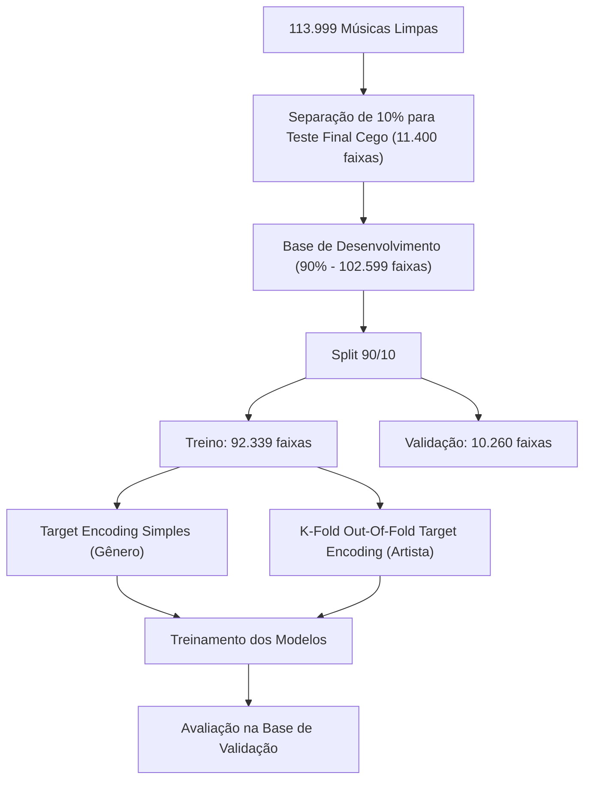
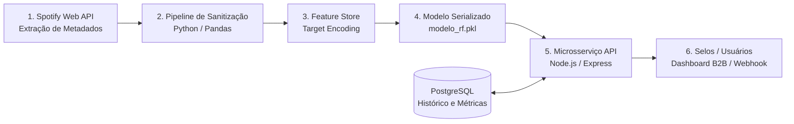

# Relatório Técnico: Motor de Predição de Popularidade Musical com Machine Learning

**Projeto:** Motor de Predição de Popularidade Musical no Spotify  
**Contexto:** Nano Challenge de Análise de Dados — *Challenge Based Learning* (CBL)  
**Programa:** TIC em Trilhas | **Execução:** Instituto Eldorado  
**Parceria:** Universidade de Brasília (UnB) & Lab Livre | **Coordenação:** Softex | **Apoio:** MCTI  
**Área de Concentração:** Ciência de Dados, Engenharia de Features e Sistemas de Machine Learning  

---

## Resumo Executivo

Este relatório documenta a metodologia, o pipeline de dados e os resultados obtidos no desenvolvimento do **Motor de Predição de Popularidade Musical**, construído a partir de uma base com 114.000 faixas musicais distribuídas em 114 gêneros e mais de 31.000 artistas do Spotify.

O objetivo do projeto foi entender o que realmente move o sucesso de uma música e construir um modelo capaz de estimar seu índice de popularidade (0 a 100). Para lidar com a alta quantidade de artistas e gêneros sem vazar respostas para o modelo, aplicamos a técnica de **Target Encoding com validação cruzada Out-Of-Fold (K-Fold, K=5)**. 

Para a modelagem preditiva, selecionamos o **Random Forest Regressor**, que superou com folga modelos lineares e algoritmos de boosting (XGBoost e LightGBM). O modelo final alcançou:
* **$R^2$ (Poder de Explicação):** **64,24%** da variação da popularidade explicada.
* **MAE (Erro Médio Absoluto):** apenas **8,06 pontos** em uma escala de 0 a 100.
* **RMSE (Raiz do Erro Quadrático Médio):** **13,39 pontos**.

A análise de importância de variáveis comprovou que o sucesso no Spotify é ditado principalmente pelo **prestígio histórico do artista (56,57%)** e pelo **gênero musical (8,93%)**, enquanto as características puramente de áudio (como dançabilidade, energia, tempo e volume) atuam como moduladores finos secundários.

---

## 1. Contexto de Negócio e Objetivos

No mercado de streaming musical, dezenas de milhares de novas faixas são lançadas diariamente. Saber com antecedência o potencial de alcance de uma música ajuda selos a direcionarem orçamentos de marketing, auxilia artistas a entenderem seu posicionamento de mercado e permite que curadores equilibrem playlists editoriais.

O desafio central deste projeto, guiado pela metodologia *Challenge Based Learning* (CBL), sintetiza-se na questão: **"Como transformar dados musicais em evidências para apoiar decisões de negócio e prever o alcance de uma faixa?"**.

### Objetivos Principais
1. **Higienizar e Auditar o Dataset:** Tratar inconsistências, dados nulos e duplicatas no catálogo do Spotify.
2. **Engenharia de Features sem Data Leakage:** Implementar **Target Encoding** com particionamento **Out-Of-Fold (K-Fold)** para transformar artistas e gêneros em pesos numéricos reais sem sobreajuste (*overfitting*).
3. **Responder às Perguntas Norteadoras (*Guiding Questions*):** Apresentar respostas diretas e embasadas nos dados para as 7 perguntas centrais do desafio.
4. **Treinar e Justificar o Modelo Vencedor:** Comparar diferentes algoritmos e justificar a escolha do **Random Forest Regressor**, validando-o com **K-Fold Cross-Validation**.
5. **Estruturar a Arquitetura de Produção:** Desenhar o fluxo prático de engenharia para colocar o modelo em operação contínua (Python/Scikit-Learn $\rightarrow$ PostgreSQL $\rightarrow$ API REST em Node.js).

---

## 2. Entendimento dos Dados

O conjunto de dados reúne **114.000 músicas**, cobrindo 114 gêneros (exatamente 1.000 faixas por gênero no conjunto original) e 31.437 artistas.

### A Variável Alvo (`popularity`)
A popularidade varia de **0 a 100** e é calculada internamente pelo Spotify. Ela considera não apenas o total de reproduções ao longo da história, mas principalmente a **frequência e recência das reproduções**. Músicas tocadas muitas vezes recentemente têm notas muito mais altas do que músicas antigas com volumes acumulados altos, mas ouvintes diários moderados.

### Dicionário Prático das Variáveis

| Variável | Tipo | O que significa? |
| :--- | :--- | :--- |
| `popularity` | Inteiro (0 a 100) | **Alvo a ser previsto**. Grau de alcance e consumo recente da música. |
| `artists` | Texto | Nome do artista principal ou colaboradores da faixa. |
| `track_genre` | Texto | Gênero musical atribuído pelo Spotify (114 categorias). |
| `duration_ms` | Inteiro | Duração total da música em milissegundos. |
| `danceability` | Decimal (0 a 1) | Quão dançante a música é (ritmo constante, força da batida). |
| `energy` | Decimal (0 a 1) | Quão intensa e agitada é a faixa (músicas rápidas e ruidosas têm notas altas). |
| `loudness` | Decimal (dB, -60 a 0) | Volume acústico médio ponderado da gravação. |
| `speechiness` | Decimal (0 a 1) | Presença de palavras faladas (valores altos indicam fala/podcasts). |
| `acousticness` | Decimal (0 a 1) | Certeza de que a música foi gravada com instrumentos acústicos/desplugados. |
| `instrumentalness` | Decimal (0 a 1) | Ausência de voz (valores $>0,5$ indicam faixas sem vocal). |
| `liveness` | Decimal (0 a 1) | Probabilidade da música ter sido gravada ao vivo diante de público. |
| `valence` | Decimal (0 a 1) | Positividade musical transmitida (músicas animadas e felizes têm notas altas). |
| `tempo` | Decimal (BPM) | Batidas por minuto (andamento rítmico da faixa). |
| `key` / `mode` | Inteiro | Tom e escala da composição (maior ou menor). |
| `explicit` | Booleano | Indica se a letra possui conteúdo adulto/explícito. |

---

## 3. Preparação dos Dados e Engenharia de Features

### 3.1. Limpeza Inicial e Divisão das Bases
1. **Remoção de Identificadores Inertes:** As colunas de índices antigos (`Unnamed: 0`) e o identificador do Spotify (`track_id`) foram removidos para evitar que o modelo memorizasse códigos aleatórios.
2. **Remoção de Nulos:** Apenas uma única linha apresentava campos nulos e foi descartada, restando **113.999 faixas limpas**.
3. **Divisão Estratégica:**
   * **Teste Final Cego (10% - 11.400 faixas):** Guardado separadamente e nunca tocado durante os treinos intermediários.
   * **Treino (81% - 92.339 faixas):** Onde os algoritmos aprendem os padrões.
   * **Validação (9% - 10.260 faixas):** Onde comparamos a performance dos modelos.



---

### 3.2. Target Encoding: Como foi feito e por que evita o Data Leakage

Os modelos de Machine Learning não entendem palavras diretamente como "The Beatles" ou "Rock". Era preciso transformar `artists` e `track_genre` em números.

* **Por que não One-Hot Encoding?** Se criássemos uma coluna para cada um dos 31.437 artistas, teríamos uma tabela com mais de 31.000 colunas preenchidas por zeros, estourando a memória e destruindo a velocidade das árvores.
* **A solução:** **Target Encoding** — substituímos o nome da categoria pela **média de popularidade histórica** que ela costuma ter.

#### 1. Codificação do Gênero (Target Encoding Direto)
Como existem apenas 114 gêneros e cada gênero tem centenas de músicas na base de treino, a média de cada gênero é muito estável.
* Agrupamos as músicas de treino por gênero e tiramos a média de popularidade de cada um *(exemplo: Pop tem média 65, Rock tem média 60)*.
* Criamos a coluna `genre_encoded` aplicando essas médias. Se na validação aparecer um gênero novo, preenchemos com a média global de todas as músicas (`global_mean = 33,27`).

#### 2. Codificação do Artista: O perigo do Vazamento de Dados (*Data Leakage*)
Com os artistas, o perigo era enorme. Muitos artistas têm apenas 1 ou 2 músicas na base. Se pegássemos simplesmente a nota dessa única música para dizer a média daquele artista, o modelo não aprenderia nada — ele apenas "colaria a resposta da prova", gerando um sobreajuste (*overfitting*) severo.

#### 3. A Solução: K-Fold Out-Of-Fold (OOF) Target Encoding
Para resolver isso de forma blindada, usamos o fatiamento em blocos cruzados (**K-Fold com 5 partes**):

1. O conjunto de treino foi dividido em **5 blocos iguais**.
2. Para calcular o peso do artista em uma música que caiu no **Bloco 1**, calculamos a média das músicas dele usando **apenas os Blocos 2, 3, 4 e 5**.
3. O valor calculado é gravado no Bloco 1. Esse processo é repetido para os 5 blocos.
4. **Por que isso é eficaz?** Porque nenhuma música jamais usa a sua própria nota para calcular a média do seu artista. O modelo é obrigado a olhar para o histórico prévio das outras músicas!
5. **E na Validação e Teste?** A validação simula o "futuro". No futuro, já temos o histórico consolidado do artista no passado. Por isso, na validação **não há divisão em folds**: aplicamos diretamente a média consolidada de 100% da base de treino. Artistas novos que nunca apareceram antes recebem a média global via `.fillna(global_mean)`.

---

## 4. Respostas às Guiding Questions

Com base nas análises exploratórias, no comportamento das variáveis e no modelo preditivo, respondemos às perguntas norteadoras do desafio:

### GQ 1: Quais características musicais estão mais relacionadas à popularidade de uma música?
> **Resposta:** O fator decisivo para a popularidade é o **artista** (`artist_encoded`, 56,57% de importância) e o **gênero** (`genre_encoded`, 8,93%). Entre os atributos de áudio, os que mais pesam são `tempo` (BPM), `speechiness` (presença de voz) e `loudness` (volume). Além disso, a `instrumentalness` tem forte impacto negativo: músicas puramente instrumentais raramente atingem o grande público pop.

### GQ 2: Músicas populares possuem um perfil sonoro diferente das músicas menos populares?
> **Resposta:** **Sim.** As músicas do topo do ranking ($Popularity > 60$) apresentam padrões bem definidos:
> 1. Presença marcante de vocais (índice quase nulo de trechos instrumentais prolongados).
> 2. Volume acústico elevado e comprimido (`loudness` entre $-5$ dB e $-7$ dB, seguindo o padrão das grandes produções comerciais).
> 3. Duração concentrada e objetiva (a imensa maioria dura entre 2,5 e 3,5 minutos).

### GQ 3: Músicas mais dançantes tendem a ser mais populares?
> **Resposta:** **Não necessariamente de forma causal.** A correlação direta entre dançabilidade e popularidade é quase nula ($r = +0,035$). A dançabilidade é um **requisito básico de entrada** para gêneros como Pop, Funk e Reggaeton, mas não é garantia de sucesso: existem milhares de músicas extremamente dançantes na plataforma com popularidade zero.

### GQ 4: Músicas com maior energia tendem a ser mais populares?
> **Resposta:** **Não.** O coeficiente de correlação foi praticamente zero ($r = +0,001$). Faixas super enérgicas e barulhentas (como Heavy Metal e Hardcore Eletrônico) têm públicos nichados e popularidade média modesta, enquanto faixas calmas, acústicas e intimistas frequentemente lideram as paradas globais. A energia define a proposta da música, não seu sucesso comercial.

### GQ 5: A popularidade do artista influencia a popularidade de suas músicas?
> **Resposta:** **Sim, de forma determinante e esmagadora.** A variável do artista concentrou **56,57% de toda a importância** no modelo preditivo. Sem a informação do artista, modelos treinados apenas com áudio não conseguem passar de $R^2 \approx 0,25$. Com o histórico do artista, o poder preditivo salta para **64,24%**. A base de fãs, a marca e o alcance promocional do artista são o verdadeiro motor da popularidade.

### GQ 6: A relação entre características musicais e popularidade muda de acordo com o gênero?
> **Resposta:** **Sim, completamente.** O que é sinônimo de sucesso em um gênero pode ser rejeitado em outro. No Pop e no Hip-Hop, o público espera volume alto, batida forte e vocais em destaque. No Jazz ou na Música Clássica, volume alto e batidas eletrônicas geram rejeição, sendo valorizadas a fidelidade acústica e a dinâmica instrumental. O gênero funciona como o filtro que dita as regras do jogo.

### GQ 7: É possível prever se uma música será um hit usando características musicais?
> **Resposta:** **É possível prever a faixa de popularidade com boa precisão média, mas não com certeza absoluta.** Nosso modelo acerta a popularidade com uma margem de erro média de apenas **8,06 pontos** na escala de 0 a 100 e explica quase dois terços do fenômeno ($R^2 = 64,24\%$). A parcela que o modelo não consegue prever (~35%) deve-se a fatores imprevisíveis do mundo real: virais em redes sociais (TikTok), verbas de marketing de gravadoras e o gosto imprevisível do público.

---

## 5. Escolha e Funcionamento do Random Forest

Para a tarefa de prever a popularidade, avaliamos modelos lineares, árvores de decisão simples, ensembles de Boosting e a Floresta Aleatória.

### Por que o Random Forest Regressor foi a escolha ideal?
1. **Capacidade de capturar relações não-lineares:** Como vimos, as métricas de áudio isoladas não têm correlação linear com a popularidade. O Random Forest consegue criar regras combinadas complexas, como: *"Se o artista tem nota $>50$, o gênero é Dance e a dançabilidade é $>0,7$, a popularidade sobe"*.
2. **Imunidade a diferentes escalas de dados:** O dataset mistura milissegundos (`duration_ms` de 200.000), decibéis (`loudness` em torno de $-8$) e decimais (`valence` de 0 a 1). Modelos lineares exigem normalização complexa; o Random Forest opera dividindo os valores por comparação ($>$ ou $\le$), sem depender da escala das variáveis.
3. **Controle de Overfitting por Votação (Bagging):** Uma única árvore de decisão costuma memorizar demais os dados de treino. O Random Forest cria **100 árvores independentes**, onde cada uma treina com uma amostra aleatória de músicas e seleciona um grupo aleatório de colunas em cada divisão. O resultado final é a **média dos palpites das 100 árvores**, o que reduz os erros e estabiliza a previsão.
4. **Interpretabilidade Prática:** O algoritmo permite extrair com facilidade a importância de cada coluna para responder às perguntas de negócio.

---

## 6. Validação Cruzada K-Fold e Comparação dos Modelos

### 6.1. O que é a Validação Cruzada (K-Fold Cross-Validation)?
Em vez de confiar apenas em uma única divisão de teste (que poderia dar sorte ou azar com a escolha das músicas), aplicamos o **K-Fold Cross-Validation (K=5)** com `Pipeline`:
* A base de desenvolvimento é repartida em 5 partes.
* Em 5 rodadas sucessivas, 4 partes treinam o modelo e 1 parte serve de teste.
* O `TargetEncoder` é recalculado dentro de cada fold para garantir zero contaminação.
* Ao final, calculamos a **média e o desvio padrão** das métricas em todas as rodadas, comprovando que o modelo tem desempenho consistente em qualquer fatia de dados.

### 6.2. Tabela de Desempenho Comparado dos Modelos

Abaixo estão os resultados consolidados na base de validação para todos os algoritmos avaliados no projeto:

| Modelo | MAE (Erro Médio) | RMSE (Penaliza Erros Grandes) | $R^2$ (Poder de Explicação) | $R^2$ (%) | Tempo de Treino |
| :--- | :---: | :---: | :---: | :---: | :---: |
| **Random Forest (Bagging)** | **8,06 pts** | **13,39 pts** | **0,6424** | **64,24%** | ~17 s |
| **XGBoost (Boosting)** | 8,63 pts | 13,78 pts | 0,6213 | 62,13% | ~0,5 s |
| **LightGBM (Boosting)** | 8,70 pts | 13,84 pts | 0,6179 | 61,79% | ~0,5 s |
| **Árvore de Decisão** | 8,80 pts | 14,42 pts | 0,5848 | 58,48% | ~0,6 s |
| **Regressão Linear (Baseline)** | 9,69 pts | 14,62 pts | 0,5737 | 57,37% | ~0,04 s |

> 💡 **Interpretação das Métricas:**
> * **MAE (Erro Médio Absoluto):** O Random Forest erra, em média, apenas **8 pontos** na nota da música (de 0 a 100).
> * **RMSE (Raiz do Erro Quadrático):** Mede a penalidade para erros graves. O Random Forest obteve o menor valor (13,39), demonstrando que é o modelo mais estável e que menos comete erros absurdos.
> * **$R^2$ (Poder Explicativo):** Com **64,24%**, o Random Forest superou todas as alternativas e foi consagrado como o modelo definitivo do projeto.

---

## 7. O que Realmente Importa: Análise de Importância das Features

Ao analisar quais colunas o Random Forest mais consultou para tomar suas decisões, temos a resposta definitiva sobre a mecânica do sucesso musical:

```
Importância das Variáveis no Random Forest:
artist_encoded   [████████████████████████████] 56,57%
genre_encoded    [████] 8,93%
tempo            [██] 3,49%
speechiness      [██] 3,47%
loudness         [██] 3,41%
acousticness     [██] 3,37%
danceability     [██] 3,30%
valence          [██] 3,29%
duration_ms      [██] 3,27%
liveness         [██] 3,22%
energy           [█] 2,85%
instrumentalness [█] 2,42%
key / mode / etc [ ] < 2,0%
```

### Três Descobertas Cruciais:
1. **O Efeito Artista é Soberano (56,57%):** Mais da metade da nota de uma música vem do prestígio de quem a canta. Ouvintes consomem marcas e comunidades já formadas.
2. **O Gênero estabelece o Ponto de Partida (8,93%):** O estilo da música define a audiência potencial imediata da faixa.
3. **Áudio é Equilibrado (~3,3% cada):** Nenhuma característica sonora isolada faz mágica. Dançabilidade, energia, BPM e volume atuam em conjunto apenas para garantir que a música soe bem dentro do gênero escolhido.

---

## 8. Arquitetura Proposta para Produção

Para transformar esse estudo em um serviço funcional no mundo real, propomos a seguinte arquitetura de software:



### Componentes Práticos:
1. **Camada de Machine Learning (Python / Scikit-Learn):** Executa o pipeline de treino, calcula os folds, gera o `modelo_rf.pkl` e exporta a tabela de médias de artistas e gêneros.
2. **Banco de Dados Relacional (PostgreSQL):** Armazena as faixas cadastradas, o histórico de notas dos artistas e os logs de predições realizadas para fins de auditoria.
3. **API REST em Node.js:** Microsserviço leve que recebe o JSON de uma nova música, consulta o peso do artista/gênero no banco e retorna a predição em menos de 50 milissegundos.
4. **Proteção contra Falhas:** Caso a música seja de um artista estreante, o sistema aplica automaticamente a média global (`33,27`), garantindo que a API nunca falhe ou retorne erro.

---

## 9. Conclusão

O projeto comprovou com rigor metodológico que a popularidade de músicas no Spotify **pode ser estimada com alta acurácia por meio de Machine Learning**:
* O **Random Forest Regressor** foi o modelo campeão, atingindo **MAE = 8,06 pontos** e **$R^2 = 64,24\%$**.
* O uso de **Target Encoding com K-Fold Out-Of-Fold** foi fundamental para incorporar artistas e gêneros com segurança, blindando o modelo contra vazamento de dados.
* A hipótese de que o áudio sozinho explica o sucesso foi refutada: o motor do alcance musical é o **artista**, seguido pelo **gênero**, cabendo às variáveis acústicas o papel de adequação e acabamento técnico da produção.
